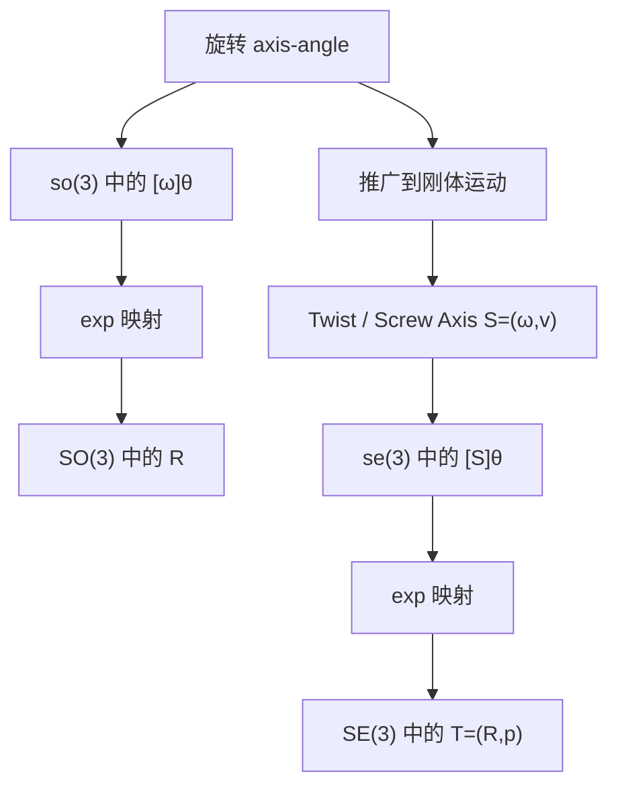

---
tags:
  - modern-robotics
  - moc
aliases:
  - Modern Robotics 首页
---

# Modern Robotics 复习首页

> [!summary]
> 这套笔记围绕 `SO(3) / SE(3)`、`so(3) / se(3)`、`Twist`、`Screw Axis`、指数映射和例题计算展开，目标是让你既能顺着课程学，也能在考前快速回忆公式和做题流程。

## 先看哪几页

- 入门总览：[[01-知识地图/课程知识地图]]
- 先补概念：[[02-旋转与刚体运动/旋转群 SO3 与 so3]]、[[02-旋转与刚体运动/刚体运动 SE3 与 se3]]
- 攻克核心：[[03-Twist与Screw/Twist、Screw Axis 与 Pitch]]、[[03-Twist与Screw/公式推导：v = -ω × q + hω]]
- 学会计算：[[04-指数映射与位姿/指数映射：从 so3 到 SO3，从 se3 到 SE3]]
- 直接刷题：[[05-例题/例题：偏置轴纯转动]]、[[05-例题/例题：真正的拧螺丝运动]]
- 考前速看：[[99-速查/Modern Robotics 速查表]]

## 一张图看清逻辑

## 推荐学习顺序

1. 先分清左半边和右半边：旋转是 `SO(3)`，刚体运动是 `SE(3)`。
2. 再理解 `Twist`：`S = (ω, v)` 不是“随便拼起来的 6 维向量”，而是刚体瞬时运动的几何编码。
3. 然后记住最关键的连接式：`v = -ω × q + hω`。
4. 最后熟练使用指数映射，把 `([ω]θ, [S]θ)` 变成 `(R, T)`。

## 复习策略

> [!tip]
> 复习时不要只背公式。每个公式都要回答三个问题：
> 1. 几何上它在描述什么？
> 2. 每个量从哪里来？
> 3. 已知什么、要求什么时怎么用？

## 相关页面

- [[欢迎]]
- [[01-知识地图/课程知识地图]]
- [[99-速查/Modern Robotics 速查表]]
