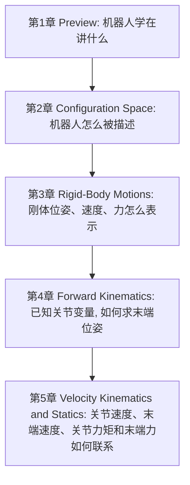

---
tags:
  - modern-robotics
  - moc
aliases:
  - Modern Robotics 首页
---

# Modern Robotics 听课笔记首页

> [!summary]
> 这套笔记按课程前五章重写，目标是服务于 Obsidian 中的长期听课记录与阶段复习，而不是只做题。结构遵循课程原始章节顺序，并把每章的主线、核心概念、关键公式、章节衔接和常见误区放在同一页里。

## 建议阅读顺序

1. [[01-总览与方法/课程地图与使用说明]]
2. [[01-总览与方法/前五章复习地图]]
3. [[02-第1章 Preview/第1章 Preview：课程全景]]
4. [[03-第2章 Configuration Space/第2章 Configuration Space：构型空间]]
5. [[04-第3章 Rigid-Body Motions/第3章 Rigid-Body Motions：刚体运动]]
6. [[05-第4章 Forward Kinematics/第4章 Forward Kinematics：正运动学]]
7. [[06-第5章 Velocity Kinematics and Statics/第5章 Velocity Kinematics and Statics：速度运动学与静力学]]
8. [[07-第6章 Inverse Kinematics/第6章 Inverse Kinematics：逆运动学]]
9. [[99-附录与速查/符号约定、公式写法与章节速查]]

## 课程主线

## 这套笔记的写法

> [!tip]
> 所有公式统一使用 Obsidian 更稳定的 `$...$` 与 `$$...$$` 语法，不再使用 `\[...\]`。

> [!tip]
> 每章笔记都按同一模板组织：
> 背景与目标 -> 小节结构 -> 核心概念 -> 关键公式 -> 与前后章的联系 -> 听课提醒。

## 从这里进入

- 导航页：[[01-总览与方法/课程地图与使用说明]]
- 前五章复习导航：[[01-总览与方法/前五章复习地图]]
- 前三章总表：[[01-总览与方法/前三章公式、概念与符号总表]]
- 第 1 章：[[02-第1章 Preview/第1章 Preview：课程全景]]
- 第 2 章：[[03-第2章 Configuration Space/第2章 Configuration Space：构型空间]]
- 第 3 章：[[04-第3章 Rigid-Body Motions/第3章 Rigid-Body Motions：刚体运动]]
- 第 4 章：[[05-第4章 Forward Kinematics/第4章 Forward Kinematics：正运动学]]
- 第 5 章：[[06-第5章 Velocity Kinematics and Statics/第5章 Velocity Kinematics and Statics：速度运动学与静力学]]
- 第 6 章：[[07-第6章 Inverse Kinematics/第6章 Inverse Kinematics：逆运动学]]
- 附录：[[99-附录与速查/符号约定、公式写法与章节速查]]

## 常用复习入口

> [!tip]
> 如果你已经学到第 5 章，之后优先从下面这 4 页进，会比直接翻文件夹更顺。

- 总导航：[[01-总览与方法/前五章复习地图]]
- 前三章变量与公式总表：[[01-总览与方法/前三章公式、概念与符号总表]]
- 第 4 章 PoE：[[05-第4章 Forward Kinematics/第4章 Forward Kinematics：正运动学]]
- 第 5 章 Jacobian 与静力学：[[06-第5章 Velocity Kinematics and Statics/第5章 Velocity Kinematics and Statics：速度运动学与静力学]]
- 第 6 章逆运动学：[[07-第6章 Inverse Kinematics/第6章 Inverse Kinematics：逆运动学]]
