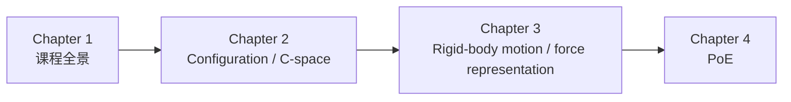

---
tags:
  - modern-robotics
  - summary
  - symbols
  - formula-sheet
---

# 前三章公式、概念与符号总表

## 1. 这页在解决什么问题

前三章最容易乱的不是某个单独公式，而是：

- 概念很多，彼此长得像；
- 记号很多，尤其是上下标、`space/body`、群和李代数；
- 公式之间有层级关系，容易只记住局部。

这页的目标是把前三章最核心的：

- 概念
- 公式
- 变量和记号
- 彼此关系

统一整理成一份可反复查阅的详细笔记。

## 2. 三章主线总图

前三章的逻辑可以压成一句话：

1. 第 1 章先告诉你这门课要解决什么问题；
2. 第 2 章先定义“机器人状态”如何描述；
3. 第 3 章再建立描述刚体位姿、速度和受力的统一数学语言。

## 3. 第一章：你真正要记住什么

### 3.1 核心概念

第 1 章不是公式章，而是框架章。最重要的概念是：

- 机器人是由 `links + joints + actuators + sensors` 组成的运动系统；
- 本书主线是 `mechanics + planning + control`；
- 后续一切都建立在“先表示 configuration，再表示 rigid-body motion”上。

### 3.2 第一章常见关键词

| 记号/词 | 含义 |
| --- | --- |
| `links` | 刚体构件 |
| `joints` | 连接构件的关节 |
| `actuators` | 驱动器 |
| `sensors` | 传感器 |
| `mechanics` | 运动学与动力学层 |
| `planning` | 轨迹/路径规划 |
| `control` | 控制输入与闭环行为 |

### 3.3 第一章最关键的认识

> [!important]
> 机器人学里很多高级内容，最后都要落回“刚体如何动、刚体如何受力、关节变量如何映射到末端运动”。

所以第一章虽然几乎没公式，但它决定了你后面看公式时的方向。

## 4. 第二章：Configuration Space 总表

### 4.1 核心概念

| 记号/词 | 含义 |
| --- | --- |
| configuration | 机器人整体构型 |
| C-space | 全部可能 configuration 构成的空间 |
| dof | 自由度 |
| task space | 任务自然发生的空间 |
| workspace | 末端可达集合 |
| holonomic constraint | 构型约束 |
| nonholonomic constraint | 速度约束 |
| Pfaffian constraint | 线性速度约束 |

### 4.2 最常用变量

| 记号 | 含义 |
| --- | --- |
| $q$ | 广义坐标 / 构型变量 |
| $\dot{q}$ | 广义速度 |
| $N$ | link 数 |
| $J$ | joint 数 |
| $f_i$ | 第 $i$ 个关节自由度 |
| $g(q)=0$ | holonomic 约束 |
| $A(q)\dot{q}=0$ | nonholonomic / Pfaffian 约束 |

### 4.3 最常用公式

空间机构常见自由度计数：

$$
\text{dof} = 6(N - 1 - J) + \sum_{i=1}^J f_i
$$

平面机构常见自由度计数：

$$
\text{dof} = 3(N - 1 - J) + \sum_{i=1}^J f_i
$$

holonomic 约束：

$$
g(q)=0
$$

Pfaffian 约束：

$$
A(q)\dot{q}=0
$$

### 4.4 第二章最容易混的点

> [!warning]
> C-space 不是 workspace。

> [!warning]
> 坐标表示不是空间本身。`(\theta_1,\theta_2)` 看起来像平面坐标，但真实拓扑可能是 $S^1\times S^1$。

## 5. 第三章：Rigid-Body Motions 总表

这是前三章里记号最多的一章，建议分成 6 组记。

### 5.1 组一：旋转与 $SO(3)$

| 记号 | 含义 |
| --- | --- |
| $R$ | 旋转矩阵 |
| $SO(3)$ | 三维旋转群 |
| $\omega$ | 角速度或轴角向量 |
| $\hat{\omega}$ | 单位旋转轴 |
| $\theta$ | 旋转角 |
| $[\omega]$ | 向量 $\omega$ 的反对称矩阵 |
| $so(3)$ | 旋转的李代数 |

旋转矩阵定义：

$$
R^T R = I,\qquad \det(R)=1
$$

hat 映射：

$$
[\omega] =
\begin{bmatrix}
0 & -\omega_3 & \omega_2 \\
\omega_3 & 0 & -\omega_1 \\
-\omega_2 & \omega_1 & 0
\end{bmatrix}
$$

Rodrigues 公式：

$$
R = e^{[\hat{\omega}]\theta}
= I + \sin\theta[\hat{\omega}] + (1-\cos\theta)[\hat{\omega}]^2
$$

### 5.2 组二：位姿与 $SE(3)$

| 记号 | 含义 |
| --- | --- |
| $T$ | 齐次变换矩阵 |
| $SE(3)$ | 刚体位姿群 |
| $p$ | 平移向量 |
| $T_{ab}$ | frame `{b}` 相对 frame `{a}` 的位姿，结果在 `{a}` 中表达 |

位姿矩阵定义：

$$
T =
\begin{bmatrix}
R & p \\
0 & 1
\end{bmatrix}
$$

关于下标：

$$
T_{ab}
$$

的意思是：

- 第二个下标 `b`：谁被描述
- 第一个下标 `a`：结果在哪个坐标系里表达

### 5.3 组三：twist 与 screw axis

| 记号 | 含义 |
| --- | --- |
| $V$ | twist |
| $V_s$ | space twist |
| $V_b$ | body twist |
| $S$ | 空间 screw axis |
| $B$ | 本体 screw axis |
| $v$ | twist 下半部分 |
| $q$ | 轴上一点 |
| $h$ | pitch |

twist 写法：

$$
V =
\begin{bmatrix}
\omega \\
v
\end{bmatrix}
$$

screw axis 的构造公式：

$$
S =
\begin{bmatrix}
\omega \\
v
\end{bmatrix},
\qquad
v = -\omega \times q + h\omega
$$

特殊情形：

- 纯旋转：$h=0$
- 纯平移：$\omega = 0$

速度场公式：

$$
\dot{p} = \omega \times p + v
$$

### 5.4 组四：$se(3)$ 与指数映射

| 记号 | 含义 |
| --- | --- |
| $[V]$ | twist 的矩阵形式 |
| $se(3)$ | 刚体运动的李代数 |
| $e^{[S]\theta}$ | 由 screw axis 生成的位姿 |

矩阵形式：

$$
[V] =
\begin{bmatrix}
[\omega] & v \\
0 & 0
\end{bmatrix}
$$

指数映射：

$$
T = e^{[S]\theta}
$$

### 5.5 组五：wrench

| 记号 | 含义 |
| --- | --- |
| $F$ | wrench |
| $F_s$ | space wrench |
| $F_b$ | body wrench |
| $f$ | 力 |
| $\tau$ | 力矩 |
| $r$ | 从参考点指向力作用点的位置向量 |

wrench 写法：

$$
F =
\begin{bmatrix}
\tau \\
f
\end{bmatrix}
$$

最基本的力矩公式：

$$
\tau = r \times f
$$

如果只有单个力、没有额外纯力矩，则：

$$
F =
\begin{bmatrix}
r\times f \\
f
\end{bmatrix}
$$

### 5.6 组六：Adjoint 与坐标变换

| 记号 | 含义 |
| --- | --- |
| $\operatorname{Ad}_T$ | 位姿 $T$ 对应的 $6\times6$ Adjoint 矩阵 |
| $V_a = \operatorname{Ad}_{T_{ab}}V_b$ | twist 的坐标变换 |
| $F_b = \operatorname{Ad}_{T_{ab}}^T F_a$ | wrench 的对偶变换 |

Adjoint 定义：

若

$$
T=
\begin{bmatrix}
R & p \\
0 & 1
\end{bmatrix}
$$

则

$$
\operatorname{Ad}_T =
\begin{bmatrix}
R & 0 \\
[p]R & R
\end{bmatrix}
$$

twist 变换：

$$
V_a = \operatorname{Ad}_{T_{ab}} V_b
$$

wrench 变换：

$$
F_b = \operatorname{Ad}_{T_{ab}}^T F_a
$$

或等价写法：

$$
F_a = \operatorname{Ad}_{T_{ab}}^{-T} F_b
$$

## 6. 功率公式为什么重要

第三章和第五章之间最重要的一条桥梁是：

$$
V^T F = \omega^T \tau + v^T f
$$

它表示刚体瞬时机械功率。

而且功率在不同参考系中不变：

$$
V_s^T F_s = V_b^T F_b
$$

这正是 wrench 为什么要按 Adjoint 的转置/逆转置形式变换的原因。

## 7. 最容易混的变量对照

### 7.1 $V_s$ 和 $V_b$

- 都是同一个物理运动
- 只是表达坐标系不同

### 7.2 $F_s$ 和 $F_b$

- 都是同一个物理 wrench
- 只是表达坐标系不同

### 7.3 $S$ 和 $V$

- $S$ 通常指单位 screw axis
- $V$ 是真实 twist

若关节速度为 $\dot{\theta}$，则：

$$
V = S\dot{\theta}
$$

### 7.4 $R$、$T$、$\operatorname{Ad}_T$

- $R$：$3\times3$，只处理旋转
- $T$：$4\times4$，处理位姿
- $\operatorname{Ad}_T$：$6\times6$，处理 twist / wrench 的表达变换

## 8. 三章公式最小必背集

如果你只背最核心的一组，建议背这 12 条：

### Chapter 2

$$
\text{dof} = 6(N - 1 - J) + \sum_{i=1}^J f_i
$$

$$
g(q)=0
$$

$$
A(q)\dot{q}=0
$$

### Chapter 3

$$
R^T R = I,\qquad \det(R)=1
$$

$$
[\omega] =
\begin{bmatrix}
0 & -\omega_3 & \omega_2 \\
\omega_3 & 0 & -\omega_1 \\
-\omega_2 & \omega_1 & 0
\end{bmatrix}
$$

$$
R = e^{[\hat{\omega}]\theta}
$$

$$
T =
\begin{bmatrix}
R & p \\
0 & 1
\end{bmatrix}
$$

$$
V =
\begin{bmatrix}
\omega \\
v
\end{bmatrix}
$$

$$
v = -\omega \times q + h\omega
$$

$$
[V] =
\begin{bmatrix}
[\omega] & v \\
0 & 0
\end{bmatrix}
$$

$$
\tau = r \times f
$$

$$
V^T F = \omega^T\tau + v^T f
$$

## 9. 复习建议

这三章不要按“每章一个孤岛”去背，最好按下面四条主线复习：

1. `configuration -> C-space -> constraints`
2. `rotation -> SO(3) -> axis-angle -> exponential`
3. `pose -> SE(3) -> twist -> screw axis`
4. `wrench -> Adjoint -> power invariance`

## 10. 对应章节入口

- Chapter 1：[[02-第1章 Preview/第1章 Preview：课程全景]]
- Chapter 2：[[03-第2章 Configuration Space/第2章 Configuration Space：构型空间]]
- Chapter 3：[[04-第3章 Rigid-Body Motions/第3章 Rigid-Body Motions：刚体运动]]
- 附录：[[99-附录与速查/符号约定、公式写法与章节速查]]
