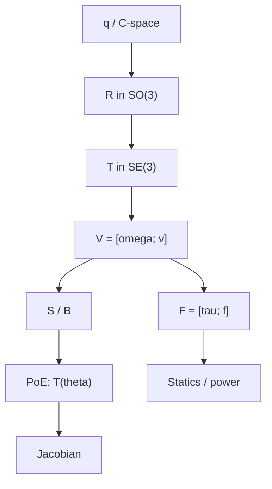

---
tags:
  - modern-robotics
  - moc
  - review
  - chapter-1-5
aliases:
  - 前五章总复习地图
  - 前五章 MOC
---

# 前五章复习地图

> [!summary]
> 这一页不是讲新知识，而是把前五章整理成 Obsidian 里的复习入口页。你可以把它当成前五章的总导航、总脑图和总复习计划。

## 1. 前五章到底在讲什么

前五章可以压缩成一条主线：

再压缩成一句话：

> 第 1 章定问题，第 2 章定状态，第 3 章定语言，第 4 章算位姿，第 5 章算速度和力。

## 2. 前五章章节入口

| 章节 | 核心问题 | 你复习时先抓什么 | 入口 |
| --- | --- | --- | --- |
| 第 1 章 Preview | 课程总问题是什么 | links / joints / planning / control 的全景关系 | [[02-第1章 Preview/第1章 Preview：课程全景]] |
| 第 2 章 Configuration Space | 机器人状态怎么描述 | `q`、DOF、C-space、constraint、workspace | [[03-第2章 Configuration Space/第2章 Configuration Space：构型空间]] |
| 第 3 章 Rigid-Body Motions | 刚体位姿、速度、受力怎么统一写 | `R/T/V/F/Ad_T/S/B` 之间的关系 | [[04-第3章 Rigid-Body Motions/第3章 Rigid-Body Motions：刚体运动]] |
| 第 4 章 Forward Kinematics | 已知关节变量怎么算末端位姿 | `M`、`S_i`、`B_i`、PoE 左乘右乘 | [[05-第4章 Forward Kinematics/第4章 Forward Kinematics：正运动学]] |
| 第 5 章 Velocity Kinematics and Statics | 已知关节速度/力如何联系末端 | Jacobian、singularity、statics、power | [[06-第5章 Velocity Kinematics and Statics/第5章 Velocity Kinematics and Statics：速度运动学与静力学]] |

## 3. 章节之间怎么衔接

### 3.1 第 1 章到第 2 章

第 1 章问的是：

> 机器人学到底在研究什么？

一旦问这个问题，就自然会进入第 2 章：

> 那机器人当前“处于什么状态”？

所以第 2 章引入：

- configuration
- DOF
- C-space
- constraint

### 3.2 第 2 章到第 3 章

第 2 章里说机器人状态可以由配置来描述，但如果配置里包含刚体姿态和位置，就会继续追问：

> 刚体的姿态和位姿本身到底怎么写？

所以第 3 章引入：

- $SO(3)$ / $so(3)$
- $SE(3)$ / $se(3)$
- twist
- wrench

### 3.3 第 3 章到第 4 章

第 3 章已经建立了刚体运动的统一语言，于是第 4 章开始把这套语言用到机器人本体上：

> 每个关节都对应一个 screw motion，那整条机械臂的末端位姿怎么求？

所以第 4 章引入：

- 零位姿 $M$
- 各关节 screw axes
- PoE

### 3.4 第 4 章到第 5 章

第 4 章解决的是“位置和姿态”，第 5 章继续问：

> 关节动得多快，末端动得多快？
> 末端受了什么力，关节上要承担什么力矩？

所以第 5 章引入：

- Jacobian
- singularity
- manipulability
- statics

## 4. 三条复习路线

### 4.1 第一次系统复习

适合刚听完一遍课程、想把逻辑串起来时用。

顺序建议：

1. [[01-总览与方法/课程地图与使用说明]]
2. [[02-第1章 Preview/第1章 Preview：课程全景]]
3. [[03-第2章 Configuration Space/第2章 Configuration Space：构型空间]]
4. [[01-总览与方法/前三章公式、概念与符号总表]]
5. [[04-第3章 Rigid-Body Motions/第3章 Rigid-Body Motions：刚体运动]]
6. [[05-第4章 Forward Kinematics/第4章 Forward Kinematics：正运动学]]
7. [[06-第5章 Velocity Kinematics and Statics/第5章 Velocity Kinematics and Statics：速度运动学与静力学]]
8. [[99-附录与速查/符号约定、公式写法与章节速查]]

### 4.2 考前压缩复习

适合时间不多时快速抓主线。

顺序建议：

1. [[01-总览与方法/前三章公式、概念与符号总表]]
2. [[04-第3章 Rigid-Body Motions/第3章 Rigid-Body Motions：刚体运动]]
3. [[05-第4章 Forward Kinematics/第4章 Forward Kinematics：正运动学]]
4. [[06-第5章 Velocity Kinematics and Statics/第5章 Velocity Kinematics and Statics：速度运动学与静力学]]
5. [[99-附录与速查/符号约定、公式写法与章节速查]]

### 4.3 做题前针对性复习

如果你正在做题，按题型回跳最省时间：

- 遇到 `SO(3)`、`SE(3)`、`Ad_T`、`twist`、`wrench`：回 [[04-第3章 Rigid-Body Motions/第3章 Rigid-Body Motions：刚体运动]]
- 遇到 `M`、`S_i`、`B_i`、PoE：回 [[05-第4章 Forward Kinematics/第4章 Forward Kinematics：正运动学]]
- 遇到 Jacobian、奇异位形、静力学：回 [[06-第5章 Velocity Kinematics and Statics/第5章 Velocity Kinematics and Statics：速度运动学与静力学]]
- 遇到配置空间、约束、workspace：回 [[03-第2章 Configuration Space/第2章 Configuration Space：构型空间]]

## 5. 前五章最重要的变量总关系

你可以把它读成：

- 第 2 章先定义机器人状态；
- 第 3 章定义刚体位姿、速度、受力；
- 第 4 章把关节运动积起来求末端位姿；
- 第 5 章再把关节速度、末端速度、末端力、关节力矩联系起来。

## 6. 最容易混的五组对象

| 容易混 | 正确区分 |
| --- | --- |
| 姿态 vs 位姿 | 姿态只有朝向，位姿是位置 + 姿态 |
| $SO(3)$ vs $SE(3)$ | 前者只管旋转，后者管旋转 + 平移 |
| $S_i$ vs $B_i$ | 同一个关节轴，不同坐标系表达 |
| twist vs screw axis | twist 是实际瞬时运动，screw axis 是单位速度下的运动轴 |
| workspace vs C-space | workspace 是末端能到的几何区域，C-space 是配置变量空间 |

## 7. Obsidian 里怎么用这套笔记

### 7.1 当成 MOC 用

这页建议固定放在侧边栏常开位置。  
如果你每次复习都先回这里，再点进章节，会比直接在目录里找文件清楚很多。

### 7.2 配合章节笔记回链

推荐这样跳：

- 从 [[00-首页]] 进总览
- 从这页进章节
- 从章节页再跳回 [[99-附录与速查/符号约定、公式写法与章节速查]]

### 7.3 配合临时听课笔记

如果你后面继续听第 6 章以后，建议每一章额外配一页：

- `第X章 听课补充`
- 里面只记老师额外强调的例子、口头提醒、你的疑问
- 最后再把稳定内容并回正式章节页

## 8. 建议固定收藏的页面

- [[00-首页]]
- [[01-总览与方法/前五章复习地图]]
- [[01-总览与方法/前三章公式、概念与符号总表]]
- [[99-附录与速查/符号约定、公式写法与章节速查]]

## 9. 学到第六章以后怎么接着复习

如果你已经听到第 6 章，那前面的主线会自然延长成：

对应入口：

- [[05-第4章 Forward Kinematics/第4章 Forward Kinematics：正运动学]]
- [[06-第5章 Velocity Kinematics and Statics/第5章 Velocity Kinematics and Statics：速度运动学与静力学]]
- [[07-第6章 Inverse Kinematics/第6章 Inverse Kinematics：逆运动学]]
