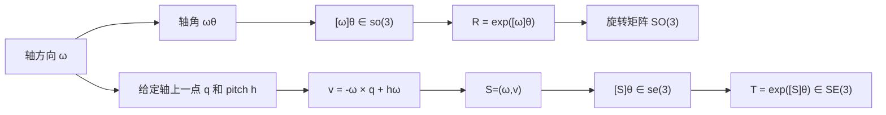

---
tags:
  - modern-robotics
  - map
---

# 课程知识地图

## 这部分在课程里的位置

这一组内容主要对应 Modern Robotics 里“刚体运动表示”的基础：

- 旋转的表示：轴角、旋转矩阵、`SO(3)`、`so(3)`
- 刚体运动的表示：齐次变换、`SE(3)`、`se(3)`
- 刚体瞬时运动：`Twist`
- 螺旋理论：`Screw Axis`、`Pitch`
- 指数坐标与指数映射：`e^[ [ω]θ ]`、`e^[ [S]θ ]`

## 左边和右边的平行关系

| 只看旋转 | 看完整刚体运动 |
| --- | --- |
| 旋转轴 `ω` | 螺旋轴 `S = (ω, v)` |
| 指数坐标 `ωθ` | 指数坐标 `Sθ` |
| 矩阵表示 `[ω]θ ∈ so(3)` | 矩阵表示 `[S]θ ∈ se(3)` |
| 指数映射到 `R ∈ SO(3)` | 指数映射到 `T ∈ SE(3)` |

## 最核心的概念链条

## 学习时最容易混的点

> [!warning]
> `v` 不是“随便的平移方向”。  
> 当 `ω ≠ 0` 时，`v` 同时编码了：
> - 螺旋轴不经过原点的偏置
> - 沿螺旋轴方向的推进量

> [!warning]
> “绕 `z` 轴转，沿 `y` 方向平移”不一定表示“沿 `z` 轴拧进去”。  
> 它可能等价于绕一条平行于 `z` 的偏置轴纯转动，或者某条真正的 screw axis 上的螺旋运动。

## 做题时的通用流程

1. 判断是 `SO(3)` 问题还是 `SE(3)` 问题。
2. 如果是刚体运动，先写出 `S = (ω, v)`。
3. 如果给了轴上一点 `q` 和 pitch `h`，用 `v = -ω × q + hω`。
4. 如果给的是 `S = (ω, v)`，反求 `h` 和轴位置。
5. 最后根据题目需要做指数映射或反求对数映射。

## 继续阅读

- [[02-旋转与刚体运动/旋转群 SO3 与 so3]]
- [[02-旋转与刚体运动/刚体运动 SE3 与 se3]]
- [[03-Twist与Screw/Twist、Screw Axis 与 Pitch]]
