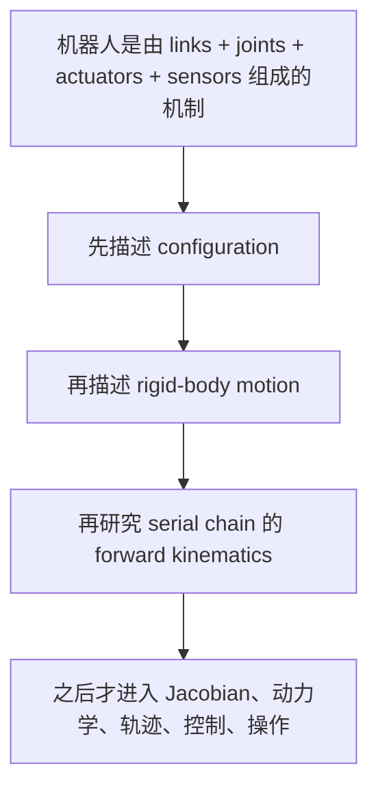

---
tags:
  - modern-robotics
  - chapter-1
  - preview
---

# 第1章 Preview：课程全景

## 1. 本章在讲什么

第 1 章不是技术细节章，而是整本书的地图。它回答的问题不是“怎么计算”，而是：

- 机器人学到底在研究什么？
- 这本书为什么聚焦 mechanics、planning 和 control？
- 后面的章节分别解决什么问题？

从教材的 Preview 可以看出，作者把机器人首先看作“由刚体和关节组成、能在物理世界中运动并施加力的机制系统”，因此后续内容的第一优先级不是感知或 AI，而是 **空间运动的建模、分析和控制**。

## 2. 本章核心主线

## 3. 作者对“机器人”的工作定义

从本章可以提炼出几个关键词：

- `links`：刚体构件；
- `joints`：连接相邻构件、限制相对运动的关节；
- `actuators`：驱动关节产生运动或力；
- `sensors`：测量关节位置、速度、力，或感知环境。

这意味着本书关心的是 **运动系统本身的结构与规律**。

## 4. 为什么本书强调 motion in the physical world

> [!important]
> 在作者的叙述里，机器人可以包含 AI 和感知，但任何机器人都必须在物理世界中运动。因此，运动学、动力学、规划和控制是最硬的基础层。

这句话对听课很重要，因为它解释了为什么：

- 第 2、3 章先花大量篇幅讲“构型空间”和“刚体运动表示”；
- 第 4 章才真正开始把这些工具用于机械臂；
- 前几章看起来“机器人味不浓”，但其实是在铺最核心的数学地基。

## 5. 第 1 章对后续章节的预告

### 5.1 Chapter 2: Configuration Space

本章预告了两个最基础的问题：

- 一个刚体有多少自由度？
- 一个机器人系统的配置应该如何表示？

这里建立的是“状态空间”的观念。以后不管做规划、运动学还是控制，你都得先知道机器人处在什么配置上。

### 5.2 Chapter 3: Rigid-Body Motions

第 3 章预告的是空间刚体运动的统一语言：

- 旋转矩阵；
- 指数坐标；
- 齐次变换；
- twist；
- wrench。

这章的核心作用是把“位姿、速度、力”都拉进统一的矩阵与向量框架。

### 5.3 Chapter 4: Forward Kinematics

第 4 章开始真正进入串联机械臂：

- 已知每个关节的位置；
- 求末端执行器相对基座的位姿。

作者强调这章使用 Product of Exponentials, PoE，而不是一开始就走 D-H 参数法。你可以把这看作本书的一条方法论选择：**用 screw theory 和指数映射统一机械臂正运动学。**

## 6. 从课程结构上看，前四章分别解决什么问题

| 章节 | 核心问题 | 输出结果 |
| --- | --- | --- |
| Chapter 1 | 这门课在讲什么 | 全局地图 |
| Chapter 2 | 机器人如何被描述为一个 configuration | C-space、DOF、约束、workspace |
| Chapter 3 | 刚体位姿、速度、力如何表示 | $SO(3)$、$SE(3)$、twist、wrench |
| Chapter 4 | 关节变量如何映射到末端位姿 | PoE 正运动学 |

## 6.1 贯穿例子：一台平面 2R 机械臂如何穿过前四章

为了把前四章真的串起来，我们固定一个最小但完整的例子：

- 机械臂有两个 revolute joints；
- 两段杆长分别为 $l_1 = 1$、$l_2 = 1$；
- 两个关节轴都垂直于平面，沿 $z$ 轴方向；
- 关节变量记为 $\theta_1,\theta_2$。

这台机械臂的图像虽然简单，但足够把前四章的主线全部串起来。

### Chapter 1 会怎么描述它

在 Preview 里，我们不会立刻算矩阵，而是先识别系统组成：

- `links`：两根刚性连杆；
- `joints`：两个转动关节；
- `actuators`：驱动两个关节转动；
- `sensors`：编码器测量 $\theta_1,\theta_2$。

这说明它是一个典型的“由刚体、关节、驱动和传感组成的运动系统”。

### Chapter 2 会问什么

Chapter 2 会先问：

- 这个系统有多少自由度？
- 它的 configuration 应该怎样描述？

对这个 2R 系统，最自然的 configuration 是：

$$
q =
\begin{bmatrix}
\theta_1 \\
\theta_2
\end{bmatrix}
$$

所以它的 C-space 是一个二维空间，而且因为两个角度变量都具有周期性，它更准确的拓扑是：

$$
S^1 \times S^1
$$

### Chapter 3 会问什么

Chapter 3 不再只看“关节角是多少”，而是问：

- 若末端处于某个姿态，如何用 $R$ 或 $T$ 表示？
- 若某个关节在转动，如何用 twist 描述它的瞬时运动？

例如第一个关节绕原点转动，它的 screw axis 可以写成：

$$
S_1 =
\begin{bmatrix}
0 \\ 0 \\ 1 \\ 0 \\ 0 \\ 0
\end{bmatrix}
$$

第二个关节在零位形时经过点 $(1,0,0)$，因此它的 screw axis 会变成：

$$
S_2 =
\begin{bmatrix}
0 \\ 0 \\ 1 \\ 0 \\ -1 \\ 0
\end{bmatrix}
$$

到这里你已经能感觉到：Chapter 3 在把“关节”翻译成“刚体运动生成元”。

### Chapter 4 会问什么

Chapter 4 会把上面的对象真正装进正运动学：

$$
T(\theta) =
e^{[S_1]\theta_1} e^{[S_2]\theta_2} M
$$

其中 $M$ 是零位形时末端位姿。  
如果两根连杆都沿 $x$ 轴伸直，那么：

$$
M =
\begin{bmatrix}
1 & 0 & 0 & 2 \\
0 & 1 & 0 & 0 \\
0 & 0 & 1 & 0 \\
0 & 0 & 0 & 1
\end{bmatrix}
$$

这就是第 4 章要解决的事：把关节变量映射成末端位姿。

### 这个例子为什么值得反复看

> [!example]
> 同一台 2R 机械臂，在四章里的身份不断变化：
> - Chapter 1：一个机器人系统；
> - Chapter 2：一个配置空间对象；
> - Chapter 3：一组刚体运动与速度对象；
> - Chapter 4：一个从关节空间到末端位姿空间的映射。

如果你能把这条链说清楚，前四章的逻辑就真的连起来了。

## 7. 听课时应该抓住什么

### 7.1 不要把第 1 章当“废话”

第 1 章最值钱的地方在于它确定了整门课的认知顺序：

先表示，再计算；先刚体，再机器人；先几何与运动学，再动力学与控制。

### 7.2 记住本书的语言风格

这本书的一个鲜明特点是：

- 强调几何直觉；
- 用李群、李代数和指数映射组织内容；
- 把 screw theory 作为主线，而不是边缘内容。

### 7.3 第 1 章的真正复习目标

复习第 1 章，不是背定义，而是要能回答：

1. 为什么机器人学首先要研究 configuration 和 rigid-body motion？
2. 为什么第 4 章的正运动学建立在第 2、3 章之上？
3. 这本书为什么偏爱 PoE 而不是一开始就用 D-H？

## 8. 与后续章节的连接

- 下一章入口：[[03-第2章 Configuration Space/第2章 Configuration Space：构型空间]]
- 总导航：[[01-总览与方法/课程地图与使用说明]]
