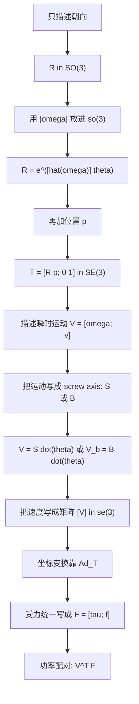
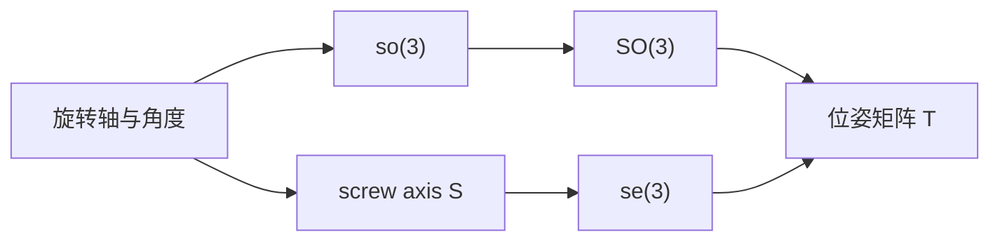

---
tags:
  - modern-robotics
  - chapter-3
  - rigid-body-motion
---

# 第3章 Rigid-Body Motions：刚体运动

## 1. 本章目标

第 2 章回答了“机器人处在什么 configuration 上”，第 3 章进一步回答：

- 一个刚体的姿态如何表示？
- 一个刚体的位姿如何表示？
- 一个刚体的角速度、线速度如何统一表示？
- 一个刚体受到的力和力矩如何统一表示？

这章是整门课最核心的数学基础之一。

## 2. 官方小节结构

- Introduction to Rigid-Body Motions
- `3.2.1` Rotation Matrices
- `3.2.2` Angular Velocities
- `3.2.3` Exponential Coordinates of Rotation
- `3.3.1` Homogeneous Transformation Matrices
- `3.3.2` Twists
- `3.3.3` Exponential Coordinates of Rigid-Body Motion
- `3.4` Wrenches

## 2.1 第 3 章变量关系总览

这一章最容易乱的，不是公式本身，而是：

- 这个变量到底在表示什么；
- 它和前一个变量是什么关系；
- 它是拿来描述姿态、位姿、速度还是受力；
- 它是在 `{s}` 里表达，还是在 `{b}` 里表达。

先把主线抓住：

### 2.1.1 一张表先看全

| 变量 | 含义 | 类型/维度 | 解决什么问题 | 和谁有关 |
| --- | --- | --- | --- | --- |
| $R$ | 姿态 | $3\times 3$ | 刚体朝哪个方向 | 属于 $SO(3)$ |
| $\omega$ | 角速度 | $3\times 1$ | 刚体转得多快、绕哪根轴转 | 可写成 $[\omega]$ |
| $[\omega]$ | 角速度的反对称矩阵 | $3\times 3$ | 让旋转能写成矩阵指数 | 属于 $so(3)$ |
| $\hat{\omega}\theta$ | 旋转指数坐标 | $3\times 1$ | 用“轴 + 角度”压缩描述旋转 | 导出 $R=e^{[\hat{\omega}]\theta}$ |
| $p$ | 位置 | $3\times 1$ | 刚体原点在哪里 | 和 $R$ 一起组成 $T$ |
| $T$ | 位姿 | $4\times 4$ | 刚体既朝哪又在哪 | 属于 $SE(3)$ |
| $T_{ab}$ | `{b}` 相对 `{a}` 的位姿，并在 `{a}` 中表达 | $4\times 4$ | 多坐标系之间不混 | 用于 `Ad`、点变换、位姿连乘 |
| $V$ | twist，刚体瞬时速度 | $6\times 1$ | 统一描述转动 + 平移 | 上半部是 $\omega$，下半部是 $v$ |
| $v$ | twist 的线速度部分 | $3\times 1$ | 配合 $\omega$ 共同决定整刚体速度场 | 不等于“任意点速度” |
| $S$ | space screw axis | $6\times 1$ | 在空间坐标系里描述运动轴 | 满足 $V_s=S\dot{\theta}$ |
| $B$ | body screw axis | $6\times 1$ | 在本体坐标系里描述运动轴 | 满足 $V_b=B\dot{\theta}$ |
| $[V]$ | twist 的矩阵形式 | $4\times 4$ | 进入 $se(3)$ 和指数映射 | 用于 $e^{[S]\theta}$ |
| $F$ | wrench，受力 | $6\times 1$ | 统一描述力和力矩 | $F=[\tau;f]$ |
| $f$ | 力 | $3\times 1$ | 表示推/拉 | 和 $\tau$ 组成 wrench |
| $\tau$ | 力矩 | $3\times 1$ | 表示转动效应 | 常由 $\tau=r\times f$ 算出 |
| $\operatorname{Ad}_T$ | Adjoint 变换 | $6\times 6$ | 把 twist / screw axis 在不同坐标系改写 | 由 $T$ 导出 |

### 2.1.2 这章的逻辑顺序

这章不是在堆概念，而是在依次回答 4 个问题：

1. 刚体朝哪边，怎么写？
2. 刚体不仅会转，还会平移，怎么一起写？
3. 刚体正在怎么动，怎么统一写？
4. 刚体受了什么力，怎么统一写？

所以变量是按下面顺序出现的：

$$
R \rightarrow T \rightarrow V \rightarrow S/B \rightarrow [V] \rightarrow F \rightarrow \operatorname{Ad}_T
$$

不是谁都平级。

- `R` 是姿态基础量；
- `T` 是在 `R` 基础上加位置；
- `V` 是位姿的瞬时变化；
- `S/B` 是“单位关节速度下的 twist”；
- `[V]` 是为了进入矩阵指数和李代数；
- `F` 是运动的对偶量；
- `Ad_T` 是为了跨坐标系表达这些量。

### 2.1.3 最核心的几组关系

#### 1. 姿态相关

$$
R \in SO(3), \qquad R^T R = I, \qquad \det(R)=1
$$

作用：判断一个矩阵是不是合法旋转矩阵。

$$
[\omega] =
\begin{bmatrix}
0 & -\omega_3 & \omega_2 \\
\omega_3 & 0 & -\omega_1 \\
-\omega_2 & \omega_1 & 0
\end{bmatrix}
$$

作用：把角速度向量变成矩阵，好进入指数映射。

$$
R = e^{[\hat{\omega}]\theta}
$$

作用：从“转轴 + 转角”恢复旋转矩阵。

#### 2. 位姿相关

$$
T =
\begin{bmatrix}
R & p \\
0 & 1
\end{bmatrix}
$$

作用：把姿态和位置统一成一个对象。

$$
T_{ab}
$$

含义：`{b}` 相对 `{a}` 的位姿，用 `{a}` 表达。

这就是为什么后面会有：

- 用 $T_{ab}$ 把 `{b}` 里的量改写到 `{a}`；
- 用 $T_{sb}$、$T_{bs}$ 区分谁相对谁。

#### 3. 速度相关

$$
V =
\begin{bmatrix}
\omega \\
v
\end{bmatrix}
$$

作用：统一写刚体瞬时运动。

这里最容易误解的是 $v$。

$v$ 不是“刚体上某个点的速度”，而是 twist 里的线速度部分。  
它和 $\omega$ 一起决定整个刚体的速度场：

$$
\dot{p} = \omega \times p + v
$$

如果运动沿一根 screw axis 发生，则

$$
S =
\begin{bmatrix}
\omega \\
v
\end{bmatrix},
\qquad
V = S\dot{\theta}
$$

如果在 body frame 里写，就变成

$$
V_b = B\dot{\theta}
$$

所以：

- `S` / `B` 说的是“这根运动轴是什么”；
- `V` / `V_b` 说的是“现在实际动得多快”。

当 $\dot{\theta}=1$ 时，`twist = screw axis`。

#### 4. screw axis 几何相关

若已知：

- 单位轴方向 $\omega$；
- 轴上一点 $q$；
- pitch $h$；

则

$$
S =
\begin{bmatrix}
\omega \\
v
\end{bmatrix},
\qquad
v = -\omega \times q + h\omega
$$

作用：把“轴在哪里、沿轴有没有推进”翻译成 twist 下半部分。

这是你前面一直问的那条最关键公式。

它的用途是：

- 从几何轴构造 screw axis；
- 进而写出 $V=S\dot{\theta}$；
- 再进而写出 $e^{[S]\theta}$。

#### 5. 李代数相关

$$
[V] =
\begin{bmatrix}
[\omega] & v \\
0 & 0
\end{bmatrix}
\in se(3)
$$

作用：把 6 维 twist 写成矩阵形式，方便做指数映射：

$$
T = e^{[S]\theta}
$$

这解决的是“怎样从瞬时运动恢复有限位姿变化”。

#### 6. 受力相关

$$
F =
\begin{bmatrix}
\tau \\
f
\end{bmatrix}
$$

作用：统一写力和力矩。

其中

$$
\tau = r \times f
$$

表示力 $f$ 对参考点产生的力矩。

功率统一写成

$$
V^T F = \omega^T \tau + v^T f
$$

作用：说明 twist 和 wrench 是一对配对量。

#### 7. 坐标变换相关

若

$$
T =
\begin{bmatrix}
R & p \\
0 & 1
\end{bmatrix}
$$

则

$$
\operatorname{Ad}_T =
\begin{bmatrix}
R & 0 \\
[p]R & R
\end{bmatrix}
$$

作用：把 twist / screw axis 从一个坐标系改写到另一个坐标系。

最常见公式：

$$
V_a = \operatorname{Ad}_{T_{ab}}V_b
$$

如果是 wrench，为了保持功率不变，会出现转置形式：

$$
F_b = \operatorname{Ad}_{T_{ab}}^T F_a
$$

### 2.1.4 变量最容易混的地方

#### `S` 和 `V`

- `S` 是 screw axis，偏几何、偏“模板”
- `V` 是实际 twist，偏运动状态
- 关系是 $V=S\dot{\theta}$

#### `v` 和“某个点的线速度”

- twist 里的 $v$ 不是任意点速度
- 任意点速度要用 $\dot{p}=\omega\times p+v$

#### `R`、`T`、`Ad_T`

- `R` 只管旋转
- `T` 管位姿
- `Ad_T` 不直接表示位姿，它表示“6 维运动/受力量怎么换坐标”

#### `S` 和 `B`

- `S` 用 space frame 表达
- `B` 用 body frame 表达
- 几何运动是同一个，只是写法参考系不同

#### `f`、`\tau`、`F`

- `f` 是力
- `\tau` 是力矩
- `F` 是把两者打包后的 wrench

### 2.1.5 一条最实用的复习线

复习第 3 章时，直接按下面 6 句背：

1. 姿态用 $R$ 表示，合法旋转矩阵属于 $SO(3)$。
2. 旋转的生成元写成 $[\omega]\in so(3)$，并通过 $R=e^{[\hat{\omega}]\theta}$ 得到有限旋转。
3. 位姿在姿态基础上加位置，写成 $T=\begin{bmatrix}R&p\\0&1\end{bmatrix}\in SE(3)$。
4. 刚体瞬时运动写成 twist：$V=[\omega;v]$。
5. 若运动沿 screw axis 发生，则 $V=S\dot{\theta}$，且 $v=-\omega\times q+h\omega$。
6. 受力写成 wrench：$F=[\tau;f]$，跨坐标系改写靠 $\operatorname{Ad}_T$。

## 3. 旋转的表示：从直觉到矩阵

### 3.1 右手定则和坐标系

课程一开始强调：

- 旋转方向服从右手定则；
- 参考系是右手系；
- 区分 space frame 和 body frame。

这是后面所有空间/本体表达的起点。

### 3.2 Rotation matrix 与 $SO(3)$

旋转矩阵满足：

$$
R^T R = I, \qquad \det(R) = 1
$$

所有这样的矩阵构成特殊正交群：

$$
SO(3)
$$

你可以把 $R$ 看成：

- 一个姿态的表示；
- 一个向量换参考系的变换；
- 一个向量或一个坐标系的旋转算子。

### 3.3 为什么课程喜欢矩阵表示

因为矩阵表示虽然不是“最少参数”，但它有几个巨大优点：

- 几何意义清楚；
- 组合自然，直接可乘；
- 与后续 $SE(3)$、Adjoint、PoE 全部兼容。

### 3.4 例子：绕 $z$ 轴旋转 $90^\circ$ 的旋转矩阵

令单位轴为：

$$
\hat{\omega} =
\begin{bmatrix}
0 \\
0 \\
1
\end{bmatrix}
$$

令旋转角为：

$$
\theta = \frac{\pi}{2}
$$

则对应的反对称矩阵是：

$$
[\hat{\omega}] =
\begin{bmatrix}
0 & -1 & 0 \\
1 & 0 & 0 \\
0 & 0 & 0
\end{bmatrix}
$$

使用 Rodrigues 公式：

$$
R = I + \sin\theta[\hat{\omega}] + (1-\cos\theta)[\hat{\omega}]^2
$$

先代入：

$$
\sin\frac{\pi}{2} = 1, \qquad \cos\frac{\pi}{2} = 0
$$

因此：

$$
R = I + [\hat{\omega}] + [\hat{\omega}]^2
$$

再算：

$$
[\hat{\omega}]^2 =
\begin{bmatrix}
-1 & 0 & 0 \\
0 & -1 & 0 \\
0 & 0 & 0
\end{bmatrix}
$$

所以：

$$
R =
\begin{bmatrix}
1 & 0 & 0 \\
0 & 1 & 0 \\
0 & 0 & 1
\end{bmatrix}
+
\begin{bmatrix}
0 & -1 & 0 \\
1 & 0 & 0 \\
0 & 0 & 0
\end{bmatrix}
+
\begin{bmatrix}
-1 & 0 & 0 \\
0 & -1 & 0 \\
0 & 0 & 0
\end{bmatrix}
=
\begin{bmatrix}
0 & -1 & 0 \\
1 & 0 & 0 \\
0 & 0 & 1
\end{bmatrix}
$$

这个计算告诉你：

- $x$ 轴方向被转到了 $y$ 轴方向；
- 旋转矩阵不是抽象符号，而是能直接算出来的姿态对象。

## 4. 角速度与 so(3)

### 4.1 角速度向量

角速度写成：

$$
\omega \in \mathbb{R}^3
$$

它的方向是旋转轴方向，模长是瞬时转速。

### 4.2 hat 映射

把向量写成反对称矩阵：

$$
[\omega] =
\begin{bmatrix}
0 & -\omega_3 & \omega_2 \\
\omega_3 & 0 & -\omega_1 \\
-\omega_2 & \omega_1 & 0
\end{bmatrix}
$$

这些矩阵构成李代数：

$$
so(3)
$$

### 4.3 为什么要从向量转成矩阵

因为一旦写成 $[\omega]$，就能自然进入矩阵指数：

$$
R = e^{[\hat{\omega}] \theta}
$$

这为旋转和刚体运动提供了统一的“生成”视角。

### 4.4 例子：角速度如何产生瞬时线速度

设刚体绕 $z$ 轴以角速度

$$
\omega =
\begin{bmatrix}
0 \\
0 \\
2
\end{bmatrix}
$$

转动，考察刚体上一点：

$$
p =
\begin{bmatrix}
1 \\
0 \\
0
\end{bmatrix}
$$

该点瞬时线速度由叉乘给出：

$$
\dot{p} = \omega \times p
$$

代入计算：

$$
\omega \times p =
\begin{bmatrix}
0 \\
0 \\
2
\end{bmatrix}
\times
\begin{bmatrix}
1 \\
0 \\
0
\end{bmatrix}
=
\begin{bmatrix}
0 \\
2 \\
0
\end{bmatrix}
$$

这说明：

- 点 $p$ 沿正 $y$ 方向运动；
- 角速度向量描述的是“整个刚体怎么转”；
- 点的线速度是由转动和点相对轴的位置共同决定的。

## 5. 旋转的指数坐标

### 5.1 轴角表示

任意旋转都可以视为绕某个单位轴 $\hat{\omega}$ 旋转角度 $\theta$，于是定义指数坐标：

$$
\omega = \hat{\omega}\theta
$$

这是一种 3 参数表示法。

### 5.2 Rodrigues 公式

矩阵指数可以写成：

$$
R = e^{[\hat{\omega}] \theta}
= I + \sin\theta [\hat{\omega}] + (1 - \cos\theta)[\hat{\omega}]^2
$$

这条公式在课程里的意义不仅是“能算”，更重要的是：

- 旋转不再只是一个几何图形；
- 它成为由李代数元素生成的群元素。

### 5.3 例子：把轴角坐标恢复成旋转矩阵

若指数坐标为：

$$
\omega =
\begin{bmatrix}
0 \\
0 \\
\frac{\pi}{3}
\end{bmatrix}
$$

则它表示：

- 单位轴 $\hat{\omega} = (0,0,1)^T$；
- 角度 $\theta = \frac{\pi}{3}$。

利用 Rodrigues 公式：

$$
R =
\begin{bmatrix}
\cos\theta & -\sin\theta & 0 \\
\sin\theta & \cos\theta & 0 \\
0 & 0 & 1
\end{bmatrix}
$$

代入：

$$
\cos\frac{\pi}{3} = \frac{1}{2}, \qquad
\sin\frac{\pi}{3} = \frac{\sqrt{3}}{2}
$$

得到：

$$
R =
\begin{bmatrix}
\frac{1}{2} & -\frac{\sqrt{3}}{2} & 0 \\
\frac{\sqrt{3}}{2} & \frac{1}{2} & 0 \\
0 & 0 & 1
\end{bmatrix}
$$

这展示了“指数坐标”和“旋转矩阵”之间的来回转换。

## 6. 从姿态到位姿：$SE(3)$

### 6.1 齐次变换矩阵

刚体位姿写成：

$$
T =
\begin{bmatrix}
R & p \\
0 & 1
\end{bmatrix}
$$

其中：

- $R \in SO(3)$ 表示姿态；
- $p \in \mathbb{R}^3$ 表示位置。

全体这样的矩阵构成：

$$
SE(3)
$$

### 6.1.1 记号 $T_{ab}$ 到底是什么意思

课程里：

$$
T_{ab}
$$

表示 **frame `{b}` 相对于 frame `{a}` 的位姿，并且矩阵元素用 `{a}` 坐标系表达**。

所以：

- 第二个下标 `b` 告诉你“谁被描述”
- 第一个下标 `a` 告诉你“结果在哪个坐标系里表达”

例如：

$$
T_{af}
$$

表示 force sensor frame `{f}` relative to apple frame `{a}`。  
如果 `{f}` 在 `{a}` 的 $x$ 方向左侧距离为 $L$，那么：

$$
T_{af} =
\begin{bmatrix}
1&0&0&-L\\
0&1&0&0\\
0&0&1&0\\
0&0&0&1
\end{bmatrix}
$$

而不是 $T_{fa}$。因为 $T_{fa}$ 的含义正好反过来。

### 6.2 课程对齐次变换的三个常见用途

这部分是课程里特别强调的：

1. 表示一个刚体配置；
2. 改变一个向量或一个坐标系的参考表达；
3. 对一个向量或一个坐标系施加位姿变换。

这三个“用法”如果在脑中不分清，后面常会把左乘、右乘、换坐标、真位移混在一起。

### 6.3 例子：一个平面位姿如何写成 $SE(3)$ 矩阵

设一个刚体在平面内：

- 绕 $z$ 轴旋转 $90^\circ$；
- 同时平移到点 $(2,1,0)$。

根据前面的旋转结果：

$$
R =
\begin{bmatrix}
0 & -1 & 0 \\
1 & 0 & 0 \\
0 & 0 & 1
\end{bmatrix}
$$

平移向量为：

$$
p =
\begin{bmatrix}
2 \\
1 \\
0
\end{bmatrix}
$$

所以：

$$
T =
\begin{bmatrix}
0 & -1 & 0 & 2 \\
1 & 0 & 0 & 1 \\
0 & 0 & 1 & 0 \\
0 & 0 & 0 & 1
\end{bmatrix}
$$

如果作用在齐次点

$$
\bar{x} =
\begin{bmatrix}
1 \\
0 \\
0 \\
1
\end{bmatrix}
$$

上，则：

$$
T\bar{x} =
\begin{bmatrix}
2 \\
2 \\
0 \\
1
\end{bmatrix}
$$

这说明原来位于局部 $x$ 轴上的点，被先转再移，落到了世界坐标中的 $(2,2,0)$。

## 7. Twist：统一描述刚体速度

### 7.1 为什么要引入 twist

如果只用：

- 角速度 $\omega$；
- 某点线速度 $v$

来描述刚体运动，表达不够统一。课程因此引入 6 维向量：

$$
V =
\begin{bmatrix}
\omega \\
v
\end{bmatrix}
$$

这就是 twist，也常被称为 spatial velocity。

### 7.2 Screw axis 的思想

当 $\omega \neq 0$ 时，一个刚体的瞬时运动可以理解为：

- 绕某条空间直线转；
- 同时沿该直线移动。

这条直线就是 screw axis。

若已知：

- 轴上一点 $q$；
- 单位方向 $\hat{s}$；
- pitch $h$；

则 screw axis 可写为：

$$
S =
\begin{bmatrix}
\hat{s} \\
-\hat{s} \times q + h\hat{s}
\end{bmatrix}
$$

> [!important]
> 这条式子非常关键，因为它把“轴在哪里”和“沿轴有没有推进”同时编码进了下半部分。

### 7.3 se(3) 表示

twist 的矩阵形式写成：

$$
[V] =
\begin{bmatrix}
[\omega] & v \\
0 & 0
\end{bmatrix}
$$

这些矩阵构成：

$$
se(3)
$$

### 7.5 Adjoint 变换矩阵是什么

如果

$$
T =
\begin{bmatrix}
R & p \\
0 & 1
\end{bmatrix}
\in SE(3)
$$

那么它对应的 Adjoint 矩阵定义为：

$$
\operatorname{Ad}_T =
\begin{bmatrix}
R & 0 \\
[p]R & R
\end{bmatrix}
$$

这里

$$
[p] =
\begin{bmatrix}
0 & -p_3 & p_2 \\
p_3 & 0 & -p_1 \\
-p_2 & p_1 & 0
\end{bmatrix}
$$

它是一个 $6\times6$ 矩阵，用来变换 twist / screw axis 的坐标表达。

最常见公式是：

$$
V_a = \operatorname{Ad}_{T_{ab}} V_b
$$

意思是：同一个刚体运动，如果在 `{b}` 里写成 $V_b$，那么在 `{a}` 里就写成 $V_a$。

### 7.6 为什么 Ad 不只是旋转

因为 twist 不是普通 3 维向量，而是

$$
V=
\begin{bmatrix}
\omega\\
v
\end{bmatrix}
$$

其中：

- $\omega$ 受姿态旋转影响
- $v$ 不仅受旋转影响，还受参考点平移影响

所以 Adjoint 里除了两个 $R$ 之外，还会多出耦合项 $[p]R$。

### 7.7 例子：只有平移时的 Adjoint

若

$$
R=I,\qquad
p=
\begin{bmatrix}
1\\0\\0
\end{bmatrix}
$$

则

$$
[p] =
\begin{bmatrix}
0&0&0\\
0&0&-1\\
0&1&0
\end{bmatrix}
$$

因此

$$
\operatorname{Ad}_T =
\begin{bmatrix}
I&0\\
[p]&I
\end{bmatrix}
$$

若

$$
V=
\begin{bmatrix}
0\\0\\1\\0\\0\\0
\end{bmatrix}
$$

表示绕 $z$ 轴纯转动，那么

$$
\operatorname{Ad}_T V =
\begin{bmatrix}
0\\0\\1\\0\\-1\\0
\end{bmatrix}
$$

这说明：即使物理运动还是“绕 $z$ 转”，换了参考原点后，twist 的下半部分也会变。

### 7.4 例子：从轴上一点和 pitch 算出 screw axis

设一条 screw axis 满足：

- 方向为

$$
\hat{s} =
\begin{bmatrix}
0 \\
0 \\
1
\end{bmatrix}
$$

- 轴上一点为

$$
q =
\begin{bmatrix}
1 \\
0 \\
0
\end{bmatrix}
$$

- pitch 为

$$
h = 2
$$

根据公式：

$$
S =
\begin{bmatrix}
\hat{s} \\
-\hat{s} \times q + h\hat{s}
\end{bmatrix}
$$

先算叉乘：

$$
\hat{s} \times q =
\begin{bmatrix}
0 \\
0 \\
1
\end{bmatrix}
\times
\begin{bmatrix}
1 \\
0 \\
0
\end{bmatrix}
=
\begin{bmatrix}
0 \\
1 \\
0
\end{bmatrix}
$$

因此：

$$
-\hat{s} \times q =
\begin{bmatrix}
0 \\
-1 \\
0
\end{bmatrix}
$$

再算：

$$
h\hat{s} =
2
\begin{bmatrix}
0 \\
0 \\
1
\end{bmatrix}
=
\begin{bmatrix}
0 \\
0 \\
2
\end{bmatrix}
$$

于是：

$$
-\hat{s} \times q + h\hat{s} =
\begin{bmatrix}
0 \\
-1 \\
2
\end{bmatrix}
$$

最终：

$$
S =
\begin{bmatrix}
0 \\
0 \\
1 \\
0 \\
-1 \\
2
\end{bmatrix}
$$

这个例子把三件事放在了一起：

- 轴的方向来自上半部分；
- 轴的位置进入下半部分的叉乘项；
- pitch 决定沿轴推进的分量。

## 8. 刚体运动的指数坐标

### 8.1 从 twist 到位姿

和旋转的情况一样，刚体位姿也可以通过指数映射得到：

$$
T = e^{[S]\theta}
$$

其中 $S\theta$ 叫刚体运动的指数坐标。

### 8.2 这一步的真正意义

它把 Chapter 3 的所有对象连成一条主线：

也就是说：

- 旋转是刚体运动的一个特例；
- $SO(3)$ 到 $SE(3)$ 的扩展，核心就是把旋转推广成 screw motion。

### 8.3 例子：由 screw axis 指数映射得到刚体位姿

继续使用上一节得到的：

$$
S =
\begin{bmatrix}
0 \\
0 \\
1 \\
0 \\
-1 \\
2
\end{bmatrix}
$$

令：

$$
\theta = \frac{\pi}{2}
$$

则旋转部分是绕 $z$ 轴转 $90^\circ$：

$$
R =
\begin{bmatrix}
0 & -1 & 0 \\
1 & 0 & 0 \\
0 & 0 & 1
\end{bmatrix}
$$

平移部分使用：

$$
p =
\left(
I\theta + (1-\cos\theta)[\omega] + (\theta-\sin\theta)[\omega]^2
\right)v
$$

其中

$$
\omega =
\begin{bmatrix}
0 \\
0 \\
1
\end{bmatrix},
\qquad
v =
\begin{bmatrix}
0 \\
-1 \\
2
\end{bmatrix}
$$

因为：

$$
\sin\frac{\pi}{2}=1,\qquad \cos\frac{\pi}{2}=0
$$

所以：

$$
p =
\left(
I\frac{\pi}{2} + [\omega] + \left(\frac{\pi}{2}-1\right)[\omega]^2
\right)v
$$

逐项计算后可得：

$$
p =
\begin{bmatrix}
1 \\
-1 \\
\pi
\end{bmatrix}
$$

因此：

$$
T =
\begin{bmatrix}
0 & -1 & 0 & 1 \\
1 & 0 & 0 & -1 \\
0 & 0 & 1 & \pi \\
0 & 0 & 0 & 1
\end{bmatrix}
$$

这就是一个完整的“拧螺丝”结果：

- 姿态转了 $90^\circ$；
- 同时沿螺旋轴方向前进了 $\pi$。

## 9. Wrench：统一描述力与力矩

第 `3.4` 节把力学对象也写成 6 维向量。

一般写作：

$$
F =
\begin{bmatrix}
\tau \\
f
\end{bmatrix}
$$

其中：

- $f$ 是力；
- $\tau$ 是力矩。

wrench 和 twist 的对应关系非常重要，因为后面速度运动学、静力学、动力学都会用这个 6 维统一表达。

### 9.1 力矩最基本的公式

若一个力 $f$ 作用在相对参考点的位置 $r$ 上，则它对该参考点产生的力矩是：

$$
\tau = r \times f
$$

如果写成 wrench，则：

$$
F=
\begin{bmatrix}
\tau\\
f
\end{bmatrix}
=
\begin{bmatrix}
r\times f\\
f
\end{bmatrix}
$$

前提是这里只有一个力，没有额外纯力矩。

### 9.2 例子：由力和作用点求 wrench

设

$$
r=
\begin{bmatrix}
2\\0\\0
\end{bmatrix},
\qquad
f=
\begin{bmatrix}
0\\10\\0
\end{bmatrix}
$$

则

$$
\tau = r\times f
=
\begin{bmatrix}
2\\0\\0
\end{bmatrix}
\times
\begin{bmatrix}
0\\10\\0
\end{bmatrix}
=
\begin{bmatrix}
0\\0\\20
\end{bmatrix}
$$

所以

$$
F=
\begin{bmatrix}
0\\0\\20\\0\\10\\0
\end{bmatrix}
$$

这说明 wrench 上半部分不是随便写的，它来自力相对参考点的位置关系。

### 9.3 wrench 的变换为什么带转置

twist 的变换是：

$$
V_a = \operatorname{Ad}_{T_{ab}} V_b
$$

而 wrench 的变换是：

$$
F_b = \operatorname{Ad}_{T_{ab}}^T F_a
$$

或等价地：

$$
F_a = \operatorname{Ad}_{T_{ab}}^{-T} F_b
$$

之所以带转置，是因为要保证功率不变：

$$
V_a^T F_a = V_b^T F_b
$$

这就是 twist 和 wrench 是一对对偶量的意思。

### 9.4 功率公式为什么是 $V^T F$

把

$$
V=
\begin{bmatrix}
\omega\\
v
\end{bmatrix},
\qquad
F=
\begin{bmatrix}
\tau\\
f
\end{bmatrix}
$$

代入可得：

$$
V^T F = \omega^T\tau + v^T f
$$

这正是刚体瞬时机械功率：

- $\omega^T\tau$ 是转动做功率
- $v^T f$ 是平移做功率

不是“算了两遍”，而是把同一个力对刚体做功分成平移部分和转动部分。

### 9.5 例子：功率不变

设

$$
V=
\begin{bmatrix}
0\\0\\2\\1\\0\\0
\end{bmatrix},
\qquad
F=
\begin{bmatrix}
0\\0\\3\\4\\0\\0
\end{bmatrix}
$$

则

$$
V^T F = 2\cdot3 + 1\cdot4 = 10
$$

换到别的坐标系后，$V$ 和 $F$ 的分量一般都会变，但只要它们按 Ad / Ad 的对偶规则去变，最后内积仍然必须等于 10。

### 9.1 例子：把一个力和一个力矩合成 wrench

设末端受到：

- 力

$$
f =
\begin{bmatrix}
3 \\
0 \\
0
\end{bmatrix}
$$

- 力矩

$$
\tau =
\begin{bmatrix}
0 \\
0 \\
2
\end{bmatrix}
$$

则对应 wrench 为：

$$
F =
\begin{bmatrix}
\tau \\
f
\end{bmatrix}
=
\begin{bmatrix}
0 \\
0 \\
2 \\
3 \\
0 \\
0
\end{bmatrix}
$$

它表示：

- 下半部分是“推/拉”的线力；
- 上半部分是“扭”的力矩；
- 课程把这两者统一打包，是为了和 twist 形成速度-力的配对框架。

## 10. 本章最重要的几个结构对应

| 几何对象 | 李代数表示 | 李群表示 |
| --- | --- | --- |
| 旋转 | $so(3)$ | $SO(3)$ |
| 刚体运动 | $se(3)$ | $SE(3)$ |

以及：

| 物理量 | 统一向量形式 |
| --- | --- |
| 刚体速度 | twist |
| 刚体受力 | wrench |

## 11. 为什么第 3 章是全书核心

> [!important]
> 第 3 章不是单独的一章“表示法介绍”，而是后面所有机器人运动学和动力学公式的语言基础。

没有这一章，后面 Chapter 4 的 PoE 就只是公式；  
有了这一章，PoE 才是“由 screw axis 生成末端位姿”的自然结论。

## 12. 听课提醒

### 12.1 不要只背群名

你需要真的分清：

- $SO(3)$ 是姿态；
- $SE(3)$ 是位姿；
- twist 是速度；
- wrench 是力。

### 12.2 不要把 $v$ 理解成“单纯平移方向”

在 screw axis 里，下半部分并不只是“沿哪个方向平移”，它还包含轴相对原点的位置关系。

### 12.3 不要把矩阵乘法当成纯代数技巧

这里的矩阵乘法每一步都有几何意义。听课时一定要问自己：

- 我现在是在换坐标表达，还是在做真实位移？
- 这个对象属于 $SO(3)$、$SE(3)$、$so(3)$ 还是 $se(3)$？

## 13. 与前后章节的关系

- 它建立在 [[03-第2章 Configuration Space/第2章 Configuration Space：构型空间]] 对 configuration 的讨论之上。
- 它直接服务于 [[05-第4章 Forward Kinematics/第4章 Forward Kinematics：正运动学]] 中的 PoE 公式。

## 14. 本章串联例子总结

> [!example]
> 这一章的例子实际上是一条连续链：
> - 先从绕 $z$ 轴的旋转矩阵开始；
> - 再看角速度如何给点产生线速度；
> - 接着把姿态升级成位姿矩阵；
> - 再把单关节写成 screw axis；
> - 最后用指数映射得到完整位姿。

如果这条链你能自己重算一遍，Chapter 3 的主干就抓住了。
