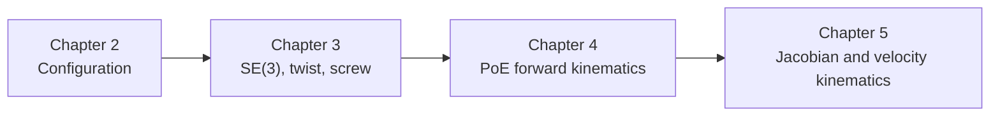

---
tags:
  - modern-robotics
  - chapter-4
  - forward-kinematics
---

# 第4章 Forward Kinematics：正运动学

## 1. 本章目标

Chapter 4 是前面三章第一次真正落到机器人机构本体上的地方。

它要解决的问题是：

> 已知各个关节变量，如何求末端执行器相对基座的位姿？

也就是：

$$
\theta \longmapsto T(\theta)
$$

## 2. 官方小节结构

- `4.1.1` Product of Exponentials Formula in the Space Frame
- `4.1.2` Product of Exponentials Formula in the End-Effector Frame
- Forward Kinematics Example

可以看到，这一章的核心几乎全部围绕 PoE 公式展开。

## 2.1 本章先抓住的两套流程

这一章最容易混的是：

- `M` 是什么；
- `S_i` 和 `B_i` 到底怎么找；
- 为什么 space 版左乘、body 版右乘；
- 求正运动学时到底先做什么、后做什么。

先把流程记住，再看细节。

### 2.1.1 Space 版 PoE 三步法

如果用空间坐标系 `{s}` 表达，各关节 screw axis 记为 $S_1,\dots,S_n$，则流程是：

1. 先找零位姿
   $$
   M = T_{sb}(0)
   $$
   含义：所有关节变量都等于 0 时，末端 `{b}` 相对 `{s}` 的位姿。
2. 再找每个关节在零位时的 space screw axis
   $$
   S_1,\dots,S_n
   $$
   注意：都是在 `\theta = 0` 时、并且用 `{s}` 表达。
3. 最后代入关节值做 PoE
   $$
   T(\theta)=e^{[S_1]\theta_1}e^{[S_2]\theta_2}\cdots e^{[S_n]\theta_n}M
   $$

你可以把它理解成：

> 当前位姿 = 各关节运动在 space frame 中依次左乘到零位姿上

### 2.1.2 Body 版 PoE 三步法

如果用末端本体坐标系 `{b}` 表达，各关节 screw axis 记为 $B_1,\dots,B_n$，则流程是：

1. 还是先找零位姿
   $$
   M = T_{sb}(0)
   $$
2. 再找每个关节在零位时的 body screw axis
   $$
   B_1,\dots,B_n
   $$
   注意：同样是在 `\theta = 0` 时，但这次是用 `{b}` 表达。
3. 最后代入关节值做 PoE
   $$
   T(\theta)=M e^{[B_1]\theta_1}e^{[B_2]\theta_2}\cdots e^{[B_n]\theta_n}
   $$

你可以把它理解成：

> 当前位姿 = 零位姿右边依次乘上各关节在 body frame 中写出的运动

### 2.1.3 两套写法的最短对照

| 版本 | screw axis 用谁表达 | PoE 写法 | 记忆方式 |
| --- | --- | --- | --- |
| space 版 | `{s}` | $T(\theta)=e^{[S_1]\theta_1}\cdots e^{[S_n]\theta_n}M$ | 空间量左乘 |
| body 版 | `{b}` | $T(\theta)=M e^{[B_1]\theta_1}\cdots e^{[B_n]\theta_n}$ | 本体量右乘 |

最短记忆：

- `S_i` 写在 `{s}` 里，所以左乘
- `B_i` 写在 `{b}` 里，所以右乘

## 2.2 怎么从图上找一个关节的 screw axis

这一段是做题时最实用的流程。无论求 $S_i$ 还是 $B_i$，本质都一样，只是最后“用哪个坐标系表达”不同。

### 2.2.1 总流程

1. 先判断关节类型
   - revolute：$\omega \neq 0$
   - prismatic：$\omega = 0$
2. 如果是转动关节，先看它绕哪根轴转
   - 轴方向就是 $\omega$
   - 再用题目要求的坐标系把它写出来
3. 再找转轴上任意一点
   $$
   q
   $$
4. 若是纯转动关节，用
   $$
   v=-\omega\times q
   $$
5. 若是一般螺旋轴，用
   $$
   v=-\omega\times q+h\omega
   $$
6. 最后拼成
   $$
   S \text{ 或 } B=
   \begin{bmatrix}
   \omega\\
   v
   \end{bmatrix}
   $$

### 2.2.2 `omega` 怎么看

`omega` 不是先算出来的，通常是先从图上看出来的。

规则很简单：

- 转动关节：`omega` 等于关节转轴方向
- 移动关节：`omega = 0`

例如平面机械臂里，所有 revolute joint 都绕垂直纸面的轴转，所以常常直接有

$$
\omega=
\begin{bmatrix}
0\\0\\1
\end{bmatrix}
$$

或者如果方向相反，就是

$$
\omega=
\begin{bmatrix}
0\\0\\-1
\end{bmatrix}
$$

### 2.2.3 `v` 怎么来

`v` 才通常是算出来的。

纯转动关节最常见：

$$
v=-\omega\times q
$$

意思是：

- `omega` 告诉你转轴方向
- `q` 告诉你转轴在空间中的位置
- 两者一起确定这根轴对应的 screw axis 下半部分

### 2.2.4 一个你刚问过的典型例子

课上有一个 body screw axis 的例子：

$$
\omega_1=
\begin{bmatrix}
0\\0\\1
\end{bmatrix},
\qquad
q_1=
\begin{bmatrix}
-3\\0\\0
\end{bmatrix}
$$

这里 $\omega_1$ 不是算出来的，而是直接看第 1 个关节的转轴方向得到的。

因为它是平面机构中的转动关节，转轴垂直纸面，所以

$$
\omega_1=\hat{z}
$$

然后再算

$$
v_1=-\omega_1\times q_1
=
-\begin{bmatrix}
0\\0\\1
\end{bmatrix}
\times
\begin{bmatrix}
-3\\0\\0
\end{bmatrix}
=
\begin{bmatrix}
0\\3\\0
\end{bmatrix}
$$

于是

$$
B_1=
\begin{bmatrix}
\omega_1\\
v_1
\end{bmatrix}
=
\begin{bmatrix}
0\\0\\1\\0\\3\\0
\end{bmatrix}
$$

这个例子最该记住的是：

- `omega` 靠看转轴方向
- `v` 靠公式算
- 最后再拼成 `S_i` 或 `B_i`

## 3. 为什么正运动学建立在第 3 章之上

第 3 章已经准备好了三样东西：

1. 刚体位姿表示：$T \in SE(3)$；
2. 刚体运动生成方式：$e^{[S]\theta}$；
3. screw axis 的表达。

所以到第 4 章，作者自然会说：

- 每个关节的运动都可以看成一个 screw motion；
- 整个串联机械臂的末端位姿就是这些关节运动依次作用后的结果。

## 4. 零位形的思想

PoE 公式的起点不是当前姿态，而是 **零位形**。

定义：

$$
M \in SE(3)
$$

表示所有关节变量都取零时，末端执行器相对基座的位姿。

这个 $M$ 是整条链条的参考基准。

> [!important]
> 如果 $M$ 没定义清楚，PoE 公式就没有锚点。

### 4.1 贯穿例子设定：平面 2R 机械臂

本章我们统一使用下面这个例子：

- 两根连杆长度分别为 $l_1 = 1$、$l_2 = 1$；
- 两个关节都是绕 $z$ 轴转动；
- 零位形时，两根连杆都沿空间坐标系的 $x$ 轴正方向伸直。

因此末端零位形是：

$$
M =
\begin{bmatrix}
1 & 0 & 0 & 2 \\
0 & 1 & 0 & 0 \\
0 & 0 & 1 & 0 \\
0 & 0 & 0 & 1
\end{bmatrix}
$$

它表示：

- 姿态和空间坐标系一致；
- 末端位置在 $(2,0,0)$。

## 5. 空间表达的 PoE 公式

### 5.1 公式

若各关节在 space frame 中的 screw axes 为 $S_1, S_2, \dots, S_n$，则：

$$
T(\theta) =
e^{[S_1]\theta_1}
e^{[S_2]\theta_2}
\cdots
e^{[S_n]\theta_n}
M
$$

### 5.2 几何意义

这个公式表示：

- 从零位形出发；
- 依次施加各关节相对于空间固定参考的运动；
- 得到当前末端位姿。

### 5.3 为什么这些 screw axes 在零位形定义

因为一旦你把每个关节轴在零位形下相对于空间坐标系的表达确定下来，PoE 公式就能借助指数映射自动生成整条链条在任意关节位置下的末端位姿。

这比逐节附着局部 link frame 的方式更统一。

### 5.4 例子：求 2R 机械臂的空间 screw axes

第一个关节轴经过原点，方向沿 $z$ 轴，因此：

$$
S_1 =
\begin{bmatrix}
0 \\
0 \\
1 \\
0 \\
0 \\
0
\end{bmatrix}
$$

第二个关节轴在零位形时经过点

$$
q_2 =
\begin{bmatrix}
1 \\
0 \\
0
\end{bmatrix}
$$

方向仍为

$$
\hat{s} =
\begin{bmatrix}
0 \\
0 \\
1
\end{bmatrix}
$$

因为是纯转动，$h = 0$，所以：

$$
S_2 =
\begin{bmatrix}
\hat{s} \\
-\hat{s} \times q_2
\end{bmatrix}
$$

先算：

$$
\hat{s} \times q_2 =
\begin{bmatrix}
0 \\
0 \\
1
\end{bmatrix}
\times
\begin{bmatrix}
1 \\
0 \\
0
\end{bmatrix}
=
\begin{bmatrix}
0 \\
1 \\
0
\end{bmatrix}
$$

因此：

$$
S_2 =
\begin{bmatrix}
0 \\
0 \\
1 \\
0 \\
-1 \\
0
\end{bmatrix}
$$

这一步的概念解释是：

- $S_1$ 对应肩关节；
- $S_2$ 对应肘关节；
- 它们都是 Chapter 3 中的 screw axis，只是现在第一次服务于机器人正运动学。

## 6. 末端表达的 PoE 公式

### 6.1 公式

若各关节在 body frame 中的 screw axes 为 $B_1, B_2, \dots, B_n$，则：

$$
T(\theta) =
M
e^{[B_1]\theta_1}
e^{[B_2]\theta_2}
\cdots
e^{[B_n]\theta_n}
$$

### 6.2 和空间表达的区别

区别不在“结果不同”，而在：

- screw axis 是在哪个参考系中表达；
- 指数项乘在 $M$ 的哪一边。

空间表达用的是固定基座参考；
本体表达用的是末端自身参考。

### 6.2.1 这张图对应的核心记忆点

课上这张图最想让你记住的，其实只有两件事：

1. **如果 screw axis 用 `{b}` 表达，就右乘。**
2. **如果 screw axis 用 `{s}` 表达，就左乘。**

更准确地写，就是：

若某个瞬时运动从 `{b}` 变到 `{b'}`，并且该 screw axis 在 `{b}` 中表达，则：

$$
T_{sb'} = T_{sb} e^{[B]\theta}
$$

若同一个运动的 screw axis 在 `{s}` 中表达，则：

$$
T_{sb'} = e^{[S]\theta} T_{sb}
$$

这就是图中右侧两条公式的含义。

### 6.2.2 为什么一个左乘、一个右乘

这背后的逻辑是：

- $T_{sb}$ 表示 frame `{b}` 相对于 frame `{s}` 的位姿；
- 下标里的第一个字母 `s` 告诉你，这个变换矩阵默认是“在 `{s}` 的坐标中表达”的；
- 如果增量运动也是在 `{s}` 里表达，那就应当直接在左边乘上去；
- 如果增量运动是在 `{b}` 里表达，那它是“跟着 `{b}` 自己走”的本体增量，所以要在右边乘。

你可以把它记成：

> [!important]
> **看 screw axis 是在哪个坐标系里写的。**
> - 在空间系里写：左乘
> - 在本体系里写：右乘

### 6.2.3 怎么理解“变换是在第一个下标对应坐标系中表达”

图里字幕那句：

> the transformation is expressed in the frame of the first subscript

对应到课程语言里就是：

$$
T_{sb}
$$

这个矩阵里的平移向量和旋转块，都是按第一个下标 `{s}` 的坐标来写的，而不是按 `{b}` 的坐标来写的。

这句话在做题时非常重要，因为很多人会把：

- “`b` 是被描述的那个 frame”
- 和
- “矩阵元素是在哪个 frame 中写出来的”

混成一件事。

正确理解是：

- 第二个下标告诉你“谁相对于谁”；
- 第一个下标告诉你“这个结果用谁的坐标表示”。

### 6.2.4 用一个极简例子记住它

设当前末端位姿是：

$$
T_{sb} =
\begin{bmatrix}
1 & 0 & 0 & 2 \\
0 & 1 & 0 & 0 \\
0 & 0 & 1 & 0 \\
0 & 0 & 0 & 1
\end{bmatrix}
$$

也就是 frame `{b}` 相对 `{s}` 位于 $(2,0,0)$，姿态和 `{s}` 一致。

现在让 `{b}` 绕它**自身原点**的 $z$ 轴转动 $\theta$。

如果把这个转动写在 `{b}` 中，那么它的增量就是：

$$
e^{[B]\theta}
=
\begin{bmatrix}
\cos\theta & -\sin\theta & 0 & 0 \\
\sin\theta & \cos\theta & 0 & 0 \\
0 & 0 & 1 & 0 \\
0 & 0 & 0 & 1
\end{bmatrix}
$$

于是应当右乘：

$$
T_{sb'} = T_{sb} e^{[B]\theta}
$$

代入可得：

$$
T_{sb'} =
\begin{bmatrix}
\cos\theta & -\sin\theta & 0 & 2 \\
\sin\theta & \cos\theta & 0 & 0 \\
0 & 0 & 1 & 0 \\
0 & 0 & 0 & 1
\end{bmatrix}
$$

你会发现：

- 平移仍是 $(2,0,0)$；
- 因为这是 frame `{b}` 在自己原地转身；
- 所以右乘非常符合“本体坐标中的增量”直觉。

反过来，如果你在空间系 `{s}` 中施加一个绕空间原点的转动增量，那就应当左乘：

$$
T_{sb'} = e^{[S]\theta} T_{sb}
$$

这时整个 frame `{b}` 会绕空间原点转过去，平移项也会随之改变。

### 6.2.5 这一页内容和 PoE 的关系

这张图其实就是 PoE 公式为什么长成下面两种样子的根本原因：

空间表达：

$$
T(\theta) =
e^{[S_1]\theta_1}
e^{[S_2]\theta_2}
\cdots
e^{[S_n]\theta_n}
M
$$

本体表达：

$$
T(\theta) =
M
e^{[B_1]\theta_1}
e^{[B_2]\theta_2}
\cdots
e^{[B_n]\theta_n}
$$

所以你以后别把它当成两个需要死记的公式，而要把它看成：

- 在空间系表达的关节增量，逐个左乘上去；
- 在末端本体系表达的关节增量，逐个右乘上去。

### 6.3 例子：先用空间表达算一次正运动学

取关节角：

$$
\theta_1 = \frac{\pi}{6}, \qquad \theta_2 = \frac{\pi}{3}
$$

先看第一个指数项：

$$
e^{[S_1]\theta_1}
=
\begin{bmatrix}
\cos\theta_1 & -\sin\theta_1 & 0 & 0 \\
\sin\theta_1 & \cos\theta_1 & 0 & 0 \\
0 & 0 & 1 & 0 \\
0 & 0 & 0 & 1
\end{bmatrix}
$$

代入

$$
\cos\frac{\pi}{6} = \frac{\sqrt{3}}{2},\qquad
\sin\frac{\pi}{6} = \frac{1}{2}
$$

得到：

$$
e^{[S_1]\theta_1}
=
\begin{bmatrix}
\frac{\sqrt{3}}{2} & -\frac{1}{2} & 0 & 0 \\
\frac{1}{2} & \frac{\sqrt{3}}{2} & 0 & 0 \\
0 & 0 & 1 & 0 \\
0 & 0 & 0 & 1
\end{bmatrix}
$$

第二个指数项代表绕经过 $(1,0,0)$ 的 $z$ 轴旋转 $\theta_2$。  
它的结果可直接写成：

$$
e^{[S_2]\theta_2}
=
\begin{bmatrix}
\cos\theta_2 & -\sin\theta_2 & 0 & 1-\cos\theta_2 \\
\sin\theta_2 & \cos\theta_2 & 0 & -\sin\theta_2 \\
0 & 0 & 1 & 0 \\
0 & 0 & 0 & 1
\end{bmatrix}
$$

代入

$$
\cos\frac{\pi}{3} = \frac{1}{2},\qquad
\sin\frac{\pi}{3} = \frac{\sqrt{3}}{2}
$$

得到：

$$
e^{[S_2]\theta_2}
=
\begin{bmatrix}
\frac{1}{2} & -\frac{\sqrt{3}}{2} & 0 & \frac{1}{2} \\
\frac{\sqrt{3}}{2} & \frac{1}{2} & 0 & -\frac{\sqrt{3}}{2} \\
0 & 0 & 1 & 0 \\
0 & 0 & 0 & 1
\end{bmatrix}
$$

于是：

$$
T(\theta) = e^{[S_1]\theta_1} e^{[S_2]\theta_2} M
$$

不过对 2R 平面机械臂，更快的方法是先写出末端位置：

$$
x = \cos\theta_1 + \cos(\theta_1 + \theta_2)
$$

$$
y = \sin\theta_1 + \sin(\theta_1 + \theta_2)
$$

因为：

$$
\theta_1 + \theta_2 = \frac{\pi}{2}
$$

所以：

$$
x = \cos\frac{\pi}{6} + \cos\frac{\pi}{2}
= \frac{\sqrt{3}}{2} + 0
= \frac{\sqrt{3}}{2}
$$

$$
y = \sin\frac{\pi}{6} + \sin\frac{\pi}{2}
= \frac{1}{2} + 1
= \frac{3}{2}
$$

末端姿态角为：

$$
\theta_1 + \theta_2 = \frac{\pi}{2}
$$

所以最终位姿是：

$$
T(\theta) =
\begin{bmatrix}
0 & -1 & 0 & \frac{\sqrt{3}}{2} \\
1 & 0 & 0 & \frac{3}{2} \\
0 & 0 & 1 & 0 \\
0 & 0 & 0 & 1
\end{bmatrix}
$$

这个结果非常重要，因为它把：

- 第 2 章的关节空间；
- 第 3 章的位姿矩阵；
- 第 4 章的正运动学映射

真正连成了一次完整计算。

## 7. 两种表达为什么都需要学

### 7.1 空间表达的直觉

空间表达更像：

- 从基座出发观察每根关节轴；
- 每根轴都在固定空间参考里写出来。

### 7.2 本体表达的直觉

本体表达更像：

- 把末端自身当成参考；
- 所有关节轴都用末端零位形参考来表达。

### 7.3 两者是同一个几何对象的两种表达

> [!important]
> 它们不是两套运动学，而是同一正运动学映射的两种坐标表达。

这和第 3 章里 twist、wrench 可以在不同坐标系里表达是同一个思想。

### 7.4 例子：由零位形求 body screw axes

对同一个 2R 机械臂，零位形时末端 frame 位于 $(2,0,0)$。  
在 body frame 中看，各关节轴的位置会重新表达。

对第 2 个关节，由于它距离末端 1 个单位，且方向仍沿 $z$ 轴，可写成：

$$
B_2 =
\begin{bmatrix}
0 \\
0 \\
1 \\
0 \\
1 \\
0
\end{bmatrix}
$$

对第 1 个关节，它在 body frame 中离末端更远，可写成：

$$
B_1 =
\begin{bmatrix}
0 \\
0 \\
1 \\
0 \\
2 \\
0
\end{bmatrix}
$$

于是 body 形式写成：

$$
T(\theta) = M e^{[B_1]\theta_1} e^{[B_2]\theta_2}
$$

这里最重要的不是立刻把矩阵乘开，而是理解：

- $S_i$ 和 $B_i$ 是同一关节的两种参考表达；
- 换的是表达坐标系，不是机构本身。

## 8. PoE 相比 D-H 的课程立场

作者在 Preview 里已经表明，PoE 的重要优点包括：

- 直接建立在 screw axis 和指数映射之上；
- 不需要给每个 link 强行附会特殊坐标系；
- 只需要基座 frame 和末端 frame；
- 几何意义更统一。

这体现了整本书的方法论：  
**先用李群和 screw theory 建统一语言，再把机器人机构装进去。**

## 9. 正运动学问题的本质

正运动学并不是“把角度代进去乘矩阵”这么简单。它本质上是在做：

$$
\text{joint space} \rightarrow \text{end-effector configuration space}
$$

也就是说：

- 输入是关节变量 $\theta$；
- 输出是末端位姿 $T(\theta)$。

这一步把第 2 章的 configuration 概念和第 3 章的刚体位姿语言真正接起来了。

## 10. 这章要掌握的对象

### 10.1 $M$

零位形下的末端位姿。

### 10.2 $S_i$

第 $i$ 个关节轴在 space frame 中的 screw axis。

### 10.3 $B_i$

第 $i$ 个关节轴在 body frame 中的 screw axis。

### 10.4 $T(\theta)$

当前关节变量下末端相对基座的位姿。

## 11. 听课时最容易混的点

### 11.1 $M$ 不是当前位姿

$M$ 只是零位形时的固定参考位姿。

### 11.2 $S_i$ 和 $B_i$ 不是两套不同机构参数

它们描述的是同一组关节轴，只是表达参考系不同。

### 11.3 左乘右乘不要机械记

一定要结合参考系去理解：

- 为什么空间表达的指数项在左边；
- 为什么本体表达的指数项在右边。

## 12. 这一章在整门课中的位置

Chapter 4 的意义在于：

- 它把“刚体运动表示”升级成“机器人机构运动表示”；
- 它也是第 5 章 Jacobian 的直接前置。

## 13. 本章复习时要能说清楚的三件事

1. 为什么 PoE 公式天然依赖 Chapter 3 的指数映射？
2. 空间表达和本体表达的区别是什么？
3. $M$、$S_i$、$B_i$ 在几何上分别代表什么？

## 13.1 本章串联例子总结

> [!example]
> 本章的贯穿例子可以浓缩成一条计算链：
> 1. 先定零位形 $M$；
> 2. 再由几何轴得到 $S_1,S_2$；
> 3. 代入 PoE 得到 $T(\theta)$；
> 4. 再把同一机构改写成 body 形式理解 $B_i$。

如果这四步你能自己重算出来，Chapter 4 的框架就稳了。

## 14. 与前后章节的关系

- 前置章节：[[04-第3章 Rigid-Body Motions/第3章 Rigid-Body Motions：刚体运动]]
- 总导航：[[01-总览与方法/课程地图与使用说明]]
- 后续章节：[[06-第5章 Velocity Kinematics and Statics/第5章 Velocity Kinematics and Statics：速度运动学与静力学]]
- 附录：[[99-附录与速查/符号约定、公式写法与章节速查]]
