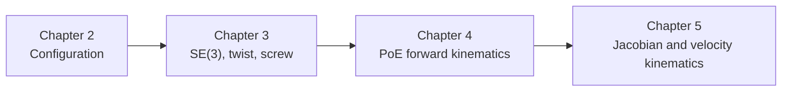

---
tags:
  - modern-robotics
  - chapter-4
  - forward-kinematics
---

# 第4章 Forward Kinematics：正运动学

## 1. 本章目标

Chapter 4 是前面三章第一次真正落到机器人机构本体上的地方。

它要解决的问题是：

> 已知各个关节变量，如何求末端执行器相对基座的位姿？

也就是：

$$
\theta \longmapsto T(\theta)
$$

## 2. 官方小节结构

- `4.1.1` Product of Exponentials Formula in the Space Frame
- `4.1.2` Product of Exponentials Formula in the End-Effector Frame
- Forward Kinematics Example

可以看到，这一章的核心几乎全部围绕 PoE 公式展开。

## 3. 为什么正运动学建立在第 3 章之上

第 3 章已经准备好了三样东西：

1. 刚体位姿表示：$T \in SE(3)$；
2. 刚体运动生成方式：$e^{[S]\theta}$；
3. screw axis 的表达。

所以到第 4 章，作者自然会说：

- 每个关节的运动都可以看成一个 screw motion；
- 整个串联机械臂的末端位姿就是这些关节运动依次作用后的结果。

## 4. 零位形的思想

PoE 公式的起点不是当前姿态，而是 **零位形**。

定义：

$$
M \in SE(3)
$$

表示所有关节变量都取零时，末端执行器相对基座的位姿。

这个 $M$ 是整条链条的参考基准。

> [!important]
> 如果 $M$ 没定义清楚，PoE 公式就没有锚点。

## 5. 空间表达的 PoE 公式

### 5.1 公式

若各关节在 space frame 中的 screw axes 为 $S_1, S_2, \dots, S_n$，则：

$$
T(\theta) =
e^{[S_1]\theta_1}
e^{[S_2]\theta_2}
\cdots
e^{[S_n]\theta_n}
M
$$

### 5.2 几何意义

这个公式表示：

- 从零位形出发；
- 依次施加各关节相对于空间固定参考的运动；
- 得到当前末端位姿。

### 5.3 为什么这些 screw axes 在零位形定义

因为一旦你把每个关节轴在零位形下相对于空间坐标系的表达确定下来，PoE 公式就能借助指数映射自动生成整条链条在任意关节位置下的末端位姿。

这比逐节附着局部 link frame 的方式更统一。

## 6. 末端表达的 PoE 公式

### 6.1 公式

若各关节在 body frame 中的 screw axes 为 $B_1, B_2, \dots, B_n$，则：

$$
T(\theta) =
M
e^{[B_1]\theta_1}
e^{[B_2]\theta_2}
\cdots
e^{[B_n]\theta_n}
$$

### 6.2 和空间表达的区别

区别不在“结果不同”，而在：

- screw axis 是在哪个参考系中表达；
- 指数项乘在 $M$ 的哪一边。

空间表达用的是固定基座参考；
本体表达用的是末端自身参考。

## 7. 两种表达为什么都需要学

### 7.1 空间表达的直觉

空间表达更像：

- 从基座出发观察每根关节轴；
- 每根轴都在固定空间参考里写出来。

### 7.2 本体表达的直觉

本体表达更像：

- 把末端自身当成参考；
- 所有关节轴都用末端零位形参考来表达。

### 7.3 两者是同一个几何对象的两种表达

> [!important]
> 它们不是两套运动学，而是同一正运动学映射的两种坐标表达。

这和第 3 章里 twist、wrench 可以在不同坐标系里表达是同一个思想。

## 8. PoE 相比 D-H 的课程立场

作者在 Preview 里已经表明，PoE 的重要优点包括：

- 直接建立在 screw axis 和指数映射之上；
- 不需要给每个 link 强行附会特殊坐标系；
- 只需要基座 frame 和末端 frame；
- 几何意义更统一。

这体现了整本书的方法论：  
**先用李群和 screw theory 建统一语言，再把机器人机构装进去。**

## 9. 正运动学问题的本质

正运动学并不是“把角度代进去乘矩阵”这么简单。它本质上是在做：

$$
\text{joint space} \rightarrow \text{end-effector configuration space}
$$

也就是说：

- 输入是关节变量 $\theta$；
- 输出是末端位姿 $T(\theta)$。

这一步把第 2 章的 configuration 概念和第 3 章的刚体位姿语言真正接起来了。

## 10. 这章要掌握的对象

### 10.1 $M$

零位形下的末端位姿。

### 10.2 $S_i$

第 $i$ 个关节轴在 space frame 中的 screw axis。

### 10.3 $B_i$

第 $i$ 个关节轴在 body frame 中的 screw axis。

### 10.4 $T(\theta)$

当前关节变量下末端相对基座的位姿。

## 11. 听课时最容易混的点

### 11.1 $M$ 不是当前位姿

$M$ 只是零位形时的固定参考位姿。

### 11.2 $S_i$ 和 $B_i$ 不是两套不同机构参数

它们描述的是同一组关节轴，只是表达参考系不同。

### 11.3 左乘右乘不要机械记

一定要结合参考系去理解：

- 为什么空间表达的指数项在左边；
- 为什么本体表达的指数项在右边。

## 12. 这一章在整门课中的位置

Chapter 4 的意义在于：

- 它把“刚体运动表示”升级成“机器人机构运动表示”；
- 它也是第 5 章 Jacobian 的直接前置。

## 13. 本章复习时要能说清楚的三件事

1. 为什么 PoE 公式天然依赖 Chapter 3 的指数映射？
2. 空间表达和本体表达的区别是什么？
3. $M$、$S_i$、$B_i$ 在几何上分别代表什么？

## 14. 与前后章节的关系

- 前置章节：[[04-第3章 Rigid-Body Motions/第3章 Rigid-Body Motions：刚体运动]]
- 总导航：[[01-总览与方法/课程地图与使用说明]]
- 附录：[[99-附录与速查/符号约定、公式写法与章节速查]]
